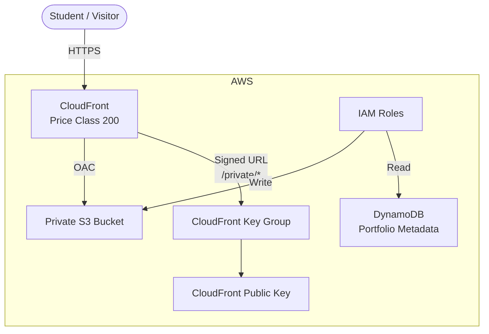
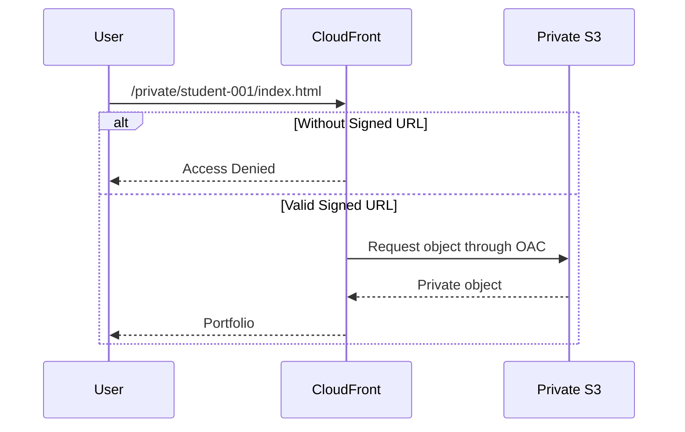

# Portfolio Platform

Cloud-native student portfolio platform built with **AWS CDK and TypeScript**. It uses Amazon S3 for portfolio files, CloudFront for content delivery, DynamoDB for metadata, and IAM for access control.

The project also implements **CloudFront Signed URLs** to protect private portfolio files.

## Architecture



### Private Files



## AWS Services

| Service        | Purpose                            |
| -------------- | ---------------------------------- |
| **S3**         | Public and private portfolio files |
| **CloudFront** | HTTPS delivery and caching         |
| **DynamoDB**   | Portfolio metadata                 |
| **IAM**        | Access control                     |
| **AWS CDK**    | Infrastructure as Code             |

## Features

* Private S3 bucket with Block Public Access
* CloudFront Origin Access Control (OAC)
* HTTPS-only access
* CloudFront Price Class 200
* Public portfolio files
* Private portfolio files
* CloudFront Signed URLs
* DynamoDB metadata
* IAM roles for controlled access
* Infrastructure deployed with AWS CDK

## Project Structure

```text
portfolio-platform/
├── bin/
├── lib/
│   └── portfolio-platform-stack.ts
├── scripts/
│   └── generate-signed-url.ts
├── website/
│   ├── public/
│   └── private/
├── keys/
├── .env.example
├── .gitignore
├── cdk.json
├── package.json
└── README.md
```

## Setup

### Install dependencies

```bash
npm install
```

### Configure environment

Create `.env` from `.env.example`:

```env
CLOUDFRONT_PRIVATE_URL=https://your-distribution.cloudfront.net/private/student-001/index.html
KEY_PAIR_ID=your-cloudfront-key-pair-id
```

### Deploy

```bash
cdk diff
cdk deploy
```

The stack creates the S3 bucket, CloudFront distribution, DynamoDB table, CloudFront key group/public key, and IAM roles.

## Signed URLs

Generate a temporary Signed URL for the private portfolio:

```bash
npx tsx scripts/generate-signed-url.ts
```

Private files under `/private/*` cannot be accessed directly. A valid Signed URL is required.

```text
Direct URL
    │
    ▼
CloudFront
    │
    └── No signature → Access Denied

Signed URL
    │
    ▼
CloudFront
    │
    └── Valid signature → Private S3 object
```

## Verification

**Public portfolio**

```text
/public/student-001/index.html
→ Accessible
```

**Private portfolio without Signed URL**

```text
/private/student-001/index.html
→ Access Denied
```

**Private portfolio with Signed URL**

```text
/private/student-001/index.html?...signature...
→ Accessible
```

## Cleanup

Remove the AWS resources when the challenge is complete:

```bash
cdk destroy
```

## Technologies

* TypeScript
* AWS CDK
* Amazon S3
* Amazon CloudFront
* Amazon DynamoDB
* AWS IAM
* Node.js
